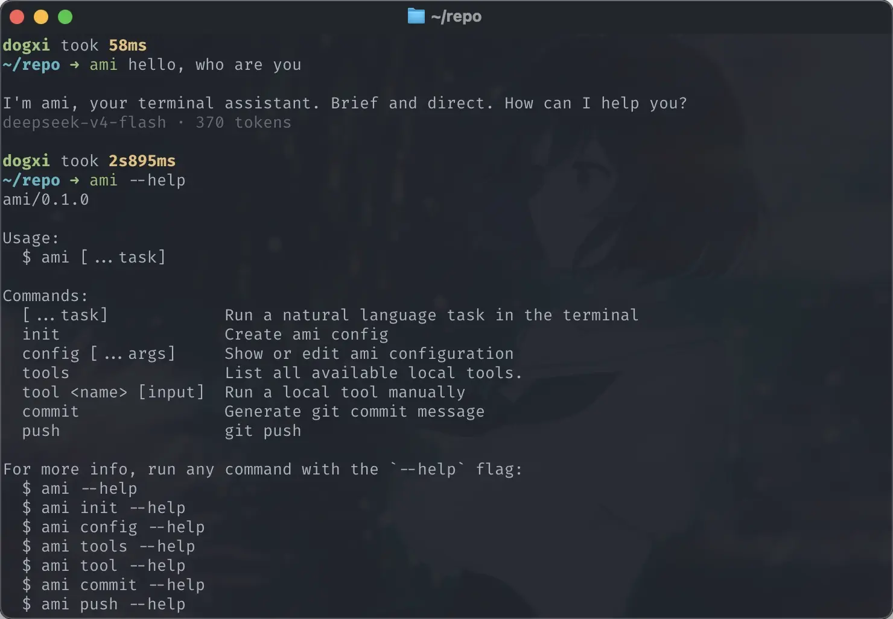

# Ami

轻量级终端 AI Agent，通过 `ami <task>` 在命令行里快速提问、读取项目上下文、调用本地工具，并辅助完成 Git commit / push 工作流。

[官网](https://ami.dogxi.me) · [npm](https://www.npmjs.com/package/@dogxi/ami) · [反馈建议](https://github.com/dogxii/ami/issues)




## ✨ 为什么用

- 在终端里直接问项目问题，不需要切到网页聊天窗口。
- 内置安全的本地工具调用，支持读取文件、列目录、搜索代码、查看 Git 状态和 Web Search。
- 支持 OpenAI-compatible API，可接入 OpenAI、DeepSeek、Qwen 或自定义服务。
- 输出保持简洁，适合快速问答、代码理解和日常开发辅助。
- 提供 `ami commit` / `ami push`，让提交信息和推送流程更顺手。

## 🚀 快速开始

```bash
npm install -g @dogxi/ami
ami init
```

然后在任意项目目录里使用：

```bash
ami "explain src/cli.ts"
ami "summarize the git status"
ami "search where loadConfig is used"
```

## ⚙️ 配置

`ami init` 会交互式创建全局配置文件：

```text
~/.config/ami/config.json
```

也可以手动查看和修改：

```bash
ami config
ami config get model
ami config set model gpt-5.4-mini
ami config set apiKey sk-...
ami config set tavilyApiKey tvly-...
```

环境变量优先级高于配置文件：

```bash
AMI_BASE_URL=https://api.deepseek.com/
AMI_API_KEY=...
AMI_MODEL=deepseek-v4-flash
AMI_TAVILY_API_KEY=...
```

`AMI_TAVILY_API_KEY` 仅在使用 `web_search` 工具时需要。

## 🧭 命令

```bash
ami <task>              # 执行自然语言任务
ami init                # 初始化全局配置
ami config              # 查看当前配置
ami config get <key>    # 读取配置项
ami config set <key> <value>  # 更新配置项
ami tools               # 列出可用工具
ami tool <name> [json]  # 手动运行工具
ami commit              # 根据 staged diff 生成提交信息并提交
ami commit --all        # 先 git add -A，再生成提交信息
ami push                # 检查分支状态并推送
ami push --yes          # 跳过 push 确认
```

## 工具能力

| 工具          | 说明                           |
| ------------- | ------------------------------ |
| `read_file`   | 读取当前目录内的文本文件       |
| `list_files`  | 列出当前目录内的文件和文件夹   |
| `search_code` | 在当前目录内搜索代码文本       |
| `git_status`  | 查看 Git working tree 状态     |
| `web_search`  | 使用 Tavily 搜索最新或外部信息 |
| `list_tools`  | 列出所有本地工具               |

## 安全边界

- `read_file` 只能读取当前工作目录内的文件。
- `.env`、`.git`、`node_modules` 会被文件读取工具拦截。
- 大文件会被拒绝读取，避免终端输出失控。
- `ami commit` 会展示生成的 commit message，并在确认后才提交。
- `ami push` 会检查 upstream、ahead commits 和未提交更改，并在确认后才推送。

## 🛠️ 本地开发

```bash
git clone https://github.com/dogxii/ami.git
cd ami
bun install
bun run dev "explain package.json"
```

类型检查：

```bash
bun typecheck
```

本地链接 CLI：

```bash
bun link
ami tools
```

官网页面在 `site/` 目录，可直接作为静态站部署。

## 📈 项目 Star 历史

<a href="https://www.star-history.com/?repos=dogxii%2Fami&type=date&legend=bottom-right">
 <picture>
   <source media="(prefers-color-scheme: dark)" srcset="https://api.star-history.com/chart?repos=dogxii/ami&type=date&theme=dark&legend=bottom-right" />
   <source media="(prefers-color-scheme: light)" srcset="https://api.star-history.com/chart?repos=dogxii/ami&type=date&legend=bottom-right" />
   
 </picture>
</a>

## 📄 License

MIT [@Dogxi](https://github.com/dogxii)
